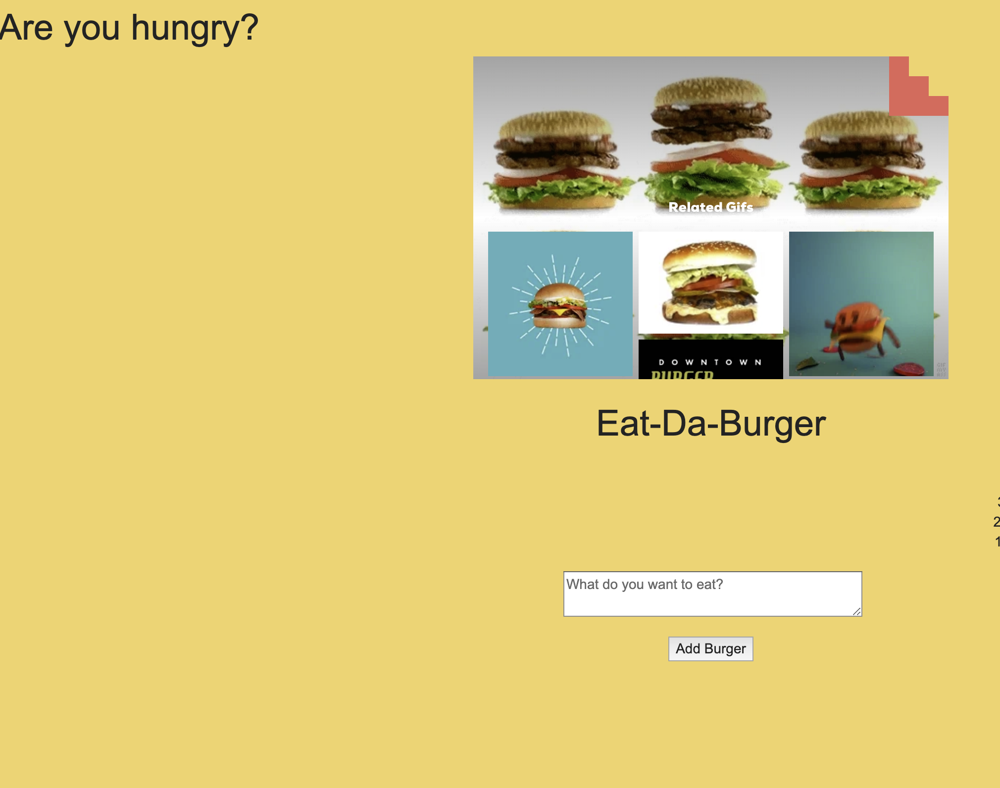

# Eat-Da-Burger

[Click me](https://eat-the-hamburger-app.herokuapp.com/)

## Overview
Eat-Da-Burger! is a restaurant app that lets users input the names of burgers they'd like to eat.

## Description
-Whenever a user submits a burger's name, the app will display the burger on the left side of the page -- waiting to be devoured.

-Each burger in the waiting area also has a Devour it! button. When the user clicks it, the burger will move to the right side of the page.

-My app will store every burger in a database, whether devoured or not.

## Built With

Node.js JavaScript runtime
MySql - Data Base

## License
MIT License

Copyright (c) [2019] [Brittany]